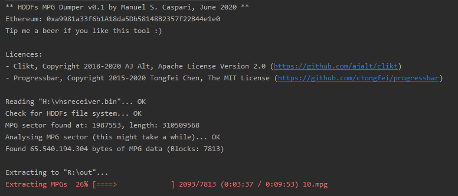

# HDDFs 00.07 MPG Dumper

[

## What is HDDFs
HDDFs is a file system that shipped with some VCR receivers. There's no real documentation
on how it operates which is why I created this little tool. It allows you
to dump your VHS converted videos from the HDD.  
  
## Usage
First create an image from your HDD with a tool like dd.
  
Then extract your MPGs by running  
```
java -jar hddfsdump.jar --input ./hddfs.bin --output ./mpg-out/
```

| Params  | Default | Description | Environment Var |
| ------------- | ------------- | ------------- | ------------- |
| --input   | | Specifies the input file  | HDDFS_DUMP_IN
| --output  | | Specifies the output directory for the final MPGs  | HDDFS_DUMP_OUT
| --no-mpg-cleanup | false | Cleaning up MPGs means skipping non sequential blocks. Some VCRs simply override deleted MPGs with new ones, resulting in an overlap at the end of the mpg. If you encounter issues with the cleanup you can use this option to disable it.  | HDDFS_DUMP_NO_CLEANUP
| --recover  | false | Dump even deleted data. You might want to use this in combination with --no-mpg-cleanup  | HDDFS_DUMP_RECOVER
| --debug  | false | Dont write to disk, debug output on console  | HDDFS_DUMP_DEBUG
  
  
## Dependencies:
* [Clikt](https://github.com/ajalt/clikt) Copyright 2018-2020 AJ Alt, Apache License Version 2.0  
* [Progressbar](https://github.com/ctongfei/progressbar) Copyright 2015-2020 Tongfei Chen, The MIT License  
  
# Thanks to
Thanks to the guys over at avsforum who dealt with the same issue around 10 years ago.  
Especially to PeterTheGeek for documenting his findings on HDDFs  
https://www.avsforum.com/forum/106-dvd-recorders-standard-def/1277209-hard-disk-file-system-investigation-magnavox-537-535-533-515-513-2160a-2160-2080-philips-3576-3575-a.html
  
## Donations / Support
Ethereum: 0xa9981a33f6b1A18da5Db58148B2357f22B44e1e0  
Bitcoin: 1Ju9G5U4iwJekRvUnG1JDme11vjxJ889Ux  
  
## Licence
    The MIT License (MIT)

    Copyright 2020-2020 Manuel S. Caspari

    Permission is hereby granted, free of charge, to any person obtaining a copy
    of this software and associated documentation files (the "Software"), to deal
    in the Software without restriction, including without limitation the rights
    to use, copy, modify, merge, publish, distribute, sublicense, and/or sell
    copies of the Software, and to permit persons to whom the Software is
    furnished to do so, subject to the following conditions:

    The above copyright notice and this permission notice shall be included in all
    copies or substantial portions of the Software.

    THE SOFTWARE IS PROVIDED "AS IS", WITHOUT WARRANTY OF ANY KIND, EXPRESS OR
    IMPLIED, INCLUDING BUT NOT LIMITED TO THE WARRANTIES OF MERCHANTABILITY,
    FITNESS FOR A PARTICULAR PURPOSE AND NONINFRINGEMENT. IN NO EVENT SHALL THE
    AUTHORS OR COPYRIGHT HOLDERS BE LIABLE FOR ANY CLAIM, DAMAGES OR OTHER
    LIABILITY, WHETHER IN AN ACTION OF CONTRACT, TORT OR OTHERWISE, ARISING FROM,
    OUT OF OR IN CONNECTION WITH THE SOFTWARE OR THE USE OR OTHER DEALINGS IN THE
    SOFTWARE.
